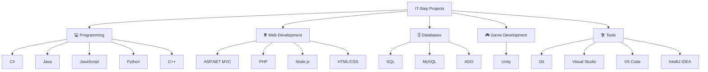

<h1 align="center">IT-Step University Projects</h1>

  

---

# 📂 Repository Contents

| Category | Description |
|:---------|:------------|
| **ALL.TXT** | Programming notes, theory, and personal study materials. |
| **ASP** | Active Server Pages assignments and laboratory work. |
| **ADO** | Database connectivity and ADO projects. |
| **Java** | Java SE and Android development assignments. |
| **C# / .NET** | Desktop applications and C# coursework. |
| **PHP** | PHP web development projects and homework. |
| **JavaScript** | JavaScript exercises, lessons and exams. |
| **MVC** | ASP.NET MVC web applications. |
| **Network Programming** | Client-server programming and networking labs. |
| **Node.js** | Backend development assignments. |
| **Qt** | Qt desktop applications. |
| **SQL** | SQL & MySQL exercises. |
| **Unity** | Unity game development projects. |

---

# 📦 Project Categories

<b>☕ Java Projects</b>

Java Fundamentals  
Android Development  
RecyclerView  
Retrofit  
Room Database  
Spring Boot  
Fragments  
ListView  
ViewPager  
Homework  
Laboratory Work  

 

<b>💜 C# / .NET Projects</b>

Windows Applications  
Homework  
Laboratory Exercises  
Lesson Materials  

 

<b>🌐 Web Development</b>

ASP  
ASP.NET MVC  
PHP  
JavaScript  
Node.js  
HTML / CSS  

 

<b>🗄️ Database </b>

SQL  
MySQL  
ADO  
Database Theory  

---

# 🛠 Tech Stack

| Languages | Frameworks | Databases | Tools |
|:---|:---|:---|:---|
| C#, Java, JavaScript, PHP, Python, C++ | ASP.NET, MVC, Node.js, Unity, Qt | SQL, MySQL, ADO | Visual Studio, VS Code, IntelliJ IDEA, Git |

---

# 📊 Repository Overview

<table>
<tr>

<td width="50%" valign="top">

### 🎓 Project Information

| Category | Details |
|:---|:---|
| Institution | **IT-Step University** |
| Type | **University Coursework** |
| Projects | **100+** |
| Duration | **3+ Years** |
| Languages | **10+** |
| Technologies | **8+** |

</td>

<td width="50%" valign="top">

### 🛠 Technology Stack

| Category | Technologies |
|:---|:---|
| Languages | C#, Java, JavaScript, PHP, Python, C++ |
| Web | ASP.NET, MVC, Node.js, HTML, CSS |
| Databases | SQL, MySQL, ADO |
| Game Development | Unity |
| Desktop Development | Qt |
| Tools | Visual Studio, VS Code, IntelliJ IDEA, Git |

</td>

</tr>
</table>

---

# 🧠 Programming Experience

| Technology | Experience |
|:---|:---:|
| 💾 SQL / MySQL | ██████████████████ **90%** |
| ⚙️ C# / .NET | ████████████████ **80%** |
| ☕ Java | ███████████████ **75%** |
| 🌐 JavaScript | ██████████████ **70%** |
| 🐍 Python | ██████████████ **70%** |
| 🐘 PHP | ████████████ **60%** |
| 🔵 C++ | ███████████ **55%** |

---

# 🧩 Technology Map

