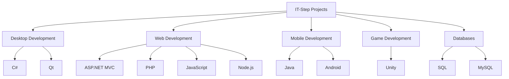

<h1 align="center">IT-Step University Projects</h1>

<p align="center">
  Collection of my university projects, laboratory work, homework, and study materials.
</p>

<p align="center">
  
</p>

<p align="center">
  
  
  
</p>
---

## 📂 Repository Contents

| Category | Description |
|:---------|:------------|
| **ALL.TXT** | Programming notes, theory, and personal study materials. |
| **ASP** | Active Server Pages assignments and laboratory work. |
| **ADO** | Database connectivity and ADO projects. |
| **Java** | Java SE and Android development assignments. |
| **C# / .NET** | Desktop applications and C# coursework. |
| **PHP** | PHP web development projects and homework. |
| **JavaScript** | JavaScript exercises, lessons and exams. |
| **MVC** | ASP.NET MVC web applications. |
| **Network Programming** | Client-server programming and networking labs. |
| **Node.js** | Backend development assignments. |
| **Qt** | Qt desktop applications. |
| **SQL** | SQL & MySQL exercises. |
| **Unity** | Unity game development projects. |

<details>
<summary><b>☕ Java Projects</b></summary>

- Java Fundamentals
- Android Development
- RecyclerView
- Retrofit
- Room Database
- Spring Boot
- Fragments
- ListView
- ViewPager
- Homework
- Laboratory Work

</details>


## 🧠 Programming Experience

```text
C# / .NET          ████████████████ 90%
Java               ██████████████   80%
JavaScript         ████████████     75%
PHP                ██████████       65%
SQL / MySQL        ████████████     75%
Python             ████████         60%
C++                ███████          50%
```

<details>
<summary><b>💜 C# / .NET</b></summary>

- Windows Applications
- Homework
- Laboratory Exercises
- Lesson Materials

</details>

<details>
<summary><b>🌐 Web Development</b></summary>

- ASP
- ASP.NET MVC
- PHP
- JavaScript
- Node.js
- HTML
- CSS

</details>

<details>
<summary><b>🗄️ Databases</b></summary>

- SQL
- MySQL
- ADO
- Database Theory

</details>

## 🛠 Tech Stack

| Languages | Frameworks | Databases | Tools |
|-----------|------------|-----------|-------|
| C#, Java, JavaScript, PHP | ASP.NET, MVC, Node.js, Unity, Qt | SQL, MySQL, ADO | Visual Studio, VS Code, IntelliJ IDEA, Git |

<p align="center">


</p>

## 📊 Repository Overview

| | |
|---|---|
| 🎓 Institution | IT-Step University |
| 💻 Languages | C#, Java, JavaScript, PHP, SQL |
| 🌍 Web | ASP.NET, MVC, Node.js |
| 🗄️ Databases | SQL, MySQL, ADO |
| 🎮 Game Development | Unity |
| 🖥 Desktop | Qt |
| 📁 Repository Type | University Coursework |

## 3. Add Mermaid diagrams (GitHub supports them)

For example, your technology ecosystem:



## 📚 Learning Journey

2021
│
├── C# Fundamentals
├── OOP Concepts
│
2022
│
├── Java SE
├── Android Development
├── SQL Databases
│
2023
│
├── ASP.NET MVC
├── PHP
├── JavaScript
│
2024
│
├── Node.js
├── Unity
├── Network Programming

## 📊 Repository Statistics

| Metric | Amount |
|---|---:|
| Projects | 100+ |
| Programming Languages | 10 |
| Years of Study | 3+ |
| Databases | 3 |
| Frameworks | 8 |
| IDEs Used | 5 |

mindmap
  root((IT-Step Projects))
    Programming
      C#
      Java
      JavaScript
      PHP
      Python
      C++
    Web
      ASP.NET
      MVC
      Node.js
      HTML
      CSS
    Database
      SQL
      MySQL
      ADO
    Tools
      Git
      Visual Studio
      VS Code
      IntelliJ IDEA
    Game Dev
      Unity

<p align="center">

</p>

<p align="center">

</p>
